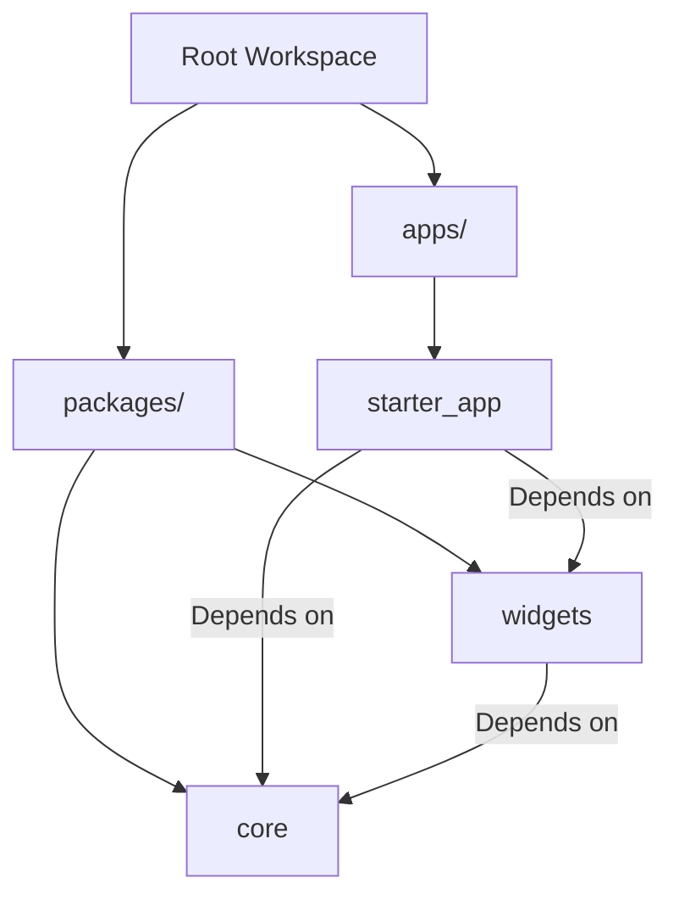

# Flutter Monorepo Workspace (Melos)

A production-ready, highly modular Flutter monorepo workspace managed with **Melos**. This architecture isolates reusable logic, design systems, and network configurations into dedicated packages, making the codebase scalable, maintainable, and ready for multi-app setups in the future.

---

## 🏗️ Workspace Architecture

The project is structured as a monorepo workspace with the following directories:



### 1. `apps/starter_app`
The main application target. It is consumer-facing and serves as the entry point for compiles (Android, iOS, Web, macOS, etc.).
- **Features Folder:** Resides directly in the app. Includes page layouts, Blocs/Cubits, and screens (e.g., Auth, Splash, Onboarding).
- **App Configuration:** Contains the main app router (`auto_route`), global theme wrappers, and the root Dependency Injection (DI) bootstrap locator.

### 2. `packages/core`
The foundational package containing headless reusable components, utilities, and integrations.
- **Dependency Injection (DI):** Uses `@InjectableInit.microPackage()` to export its DI registration.
- **Networking:** Extracted HTTP network clients (`dio`) and token, network, retry interceptors.
- **Database:** Local preference utility modules (`hive`).
- **Translations (l10n):** Centralized translation assets (`.arb` files) and localization generators.
- **Cubit States:** Global application blocs such as `InternetCubit`, `LocaleCubit`, and `ThemeCubit`.
- **System Theme:** Base definitions for `LightTheme`, `DarkTheme`, and `AppColors`.

### 3. `packages/widgets`
The design system package containing reusable UI elements.
- **Custom Buttons:** Reusable interactive items like `SocialButton`.
- **Form Controls / Inputs:** Standardized form text fields.
- **Layouts & Shimmers:** Uniform loader animations, shimmers, and SVG graphics.

---

## 🛠️ Melos Commands Reference

Melos manages workspace packages concurrently. Run these commands from the root directory:

| Command | Action | Description |
|:---|:---|:---|
| `melos bootstrap` | `melos bootstrap` | Resolves package dependencies and links them locally. |
| `melos run codegen` | Concurrent `build_runner` | Runs code-generation across all packages concurrently. |
| `melos run analyze` | `flutter analyze` | Performs Dart static analysis across the entire monorepo. |
| `melos run postclean`| `flutter clean` | Cleans build caches across all packages. |

### Sequential Code Generation (Recommended)
To prevent race conditions during concurrent builds (e.g., when the main app tries to import ungenerated classes from `core`), run them sequentially:
```bash
# 1. Build core code generation first
cd packages/core && dart run build_runner build --delete-conflicting-outputs

# 2. Build starter_app code generation second
cd ../../apps/starter_app && dart run build_runner build --delete-conflicting-outputs
```

---

## 🚀 Setting Up the Project Locally

Follow these steps to get your monorepo workspace up and running:

### Prerequisites
Make sure Melos is installed globally on your machine:
```bash
dart pub global activate melos
```

### Step-by-Step Installation

1. **Bootstrap the Workspace:**
   Run bootstrap from the root of the project to retrieve package dependencies and link local packages:
   ```bash
   melos bootstrap
   ```

2. **Set Up the Environment File:**
   Make sure you copy the `.env` keys to the core package:
   ```bash
   cp apps/starter_app/.env packages/core/.env
   ```

3. **Generate Source Code (DI/Routing/l10n):**
   ```bash
   # Run sequential build (highly recommended)
   cd packages/core && dart run build_runner build --delete-conflicting-outputs
   cd ../../apps/starter_app && dart run build_runner build --delete-conflicting-outputs
   ```

4. **Run the Application:**
   ```bash
   cd apps/starter_app
   flutter run
   ```

---

## 📐 Guidelines for Adding Code

### Adding Dependencies
- If a dependency is shared (e.g., `dio`, `injectable`, `flutter_bloc`), add it to [`packages/core/pubspec.yaml`](file:///Users/infynnosolutions/flutter-sdk/projects/starter_template/packages/core/pubspec.yaml).
- For pure UI packages (e.g., `shimmer`, `google_fonts`), add them to [`packages/widgets/pubspec.yaml`](file:///Users/infynnosolutions/flutter-sdk/projects/starter_template/packages/widgets/pubspec.yaml).

### Exporting Core Modules
When you add new directories or files to `packages/core` or `packages/widgets`, make sure to export them in the package-level root file:
- For Core: Export files in [`packages/core/lib/core.dart`](file:///Users/infynnosolutions/flutter-sdk/projects/starter_template/packages/core/lib/core.dart).
- For Widgets: Export files in [`packages/widgets/lib/widgets.dart`](file:///Users/infynnosolutions/flutter-sdk/projects/starter_template/packages/widgets/lib/widgets.dart).

### Registering Sub-Package Dependencies (DI)
`packages/core` registers its dependencies as a **micro-package**. If you add a new `@injectable` class in `core`:
1. Annotate your class with `@injectable` / `@lazySingleton`.
2. Run code generation in `packages/core`. This updates `CorePackageModule` in [`packages/core/lib/di/injection.module.dart`](file:///Users/infynnosolutions/flutter-sdk/projects/starter_template/packages/core/lib/di/injection.module.dart).
3. The main application automatically aggregates the new registrations since [`apps/starter_app/lib/core/di/injection.dart`](file:///Users/infynnosolutions/flutter-sdk/projects/starter_template/apps/starter_app/lib/core/di/injection.dart) includes `ExternalModule(CorePackageModule)`.
4. Re-run code generation inside `apps/starter_app` to compile the final locator.
